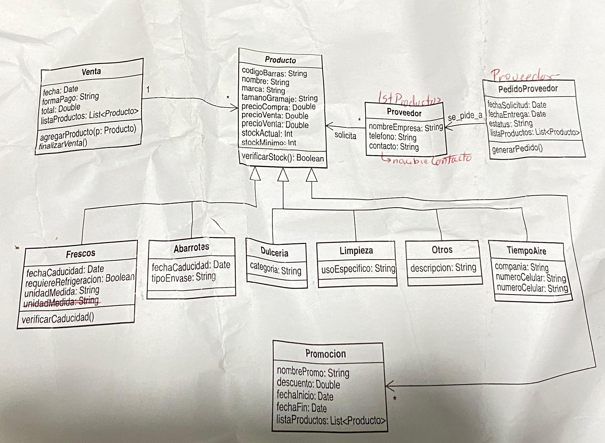
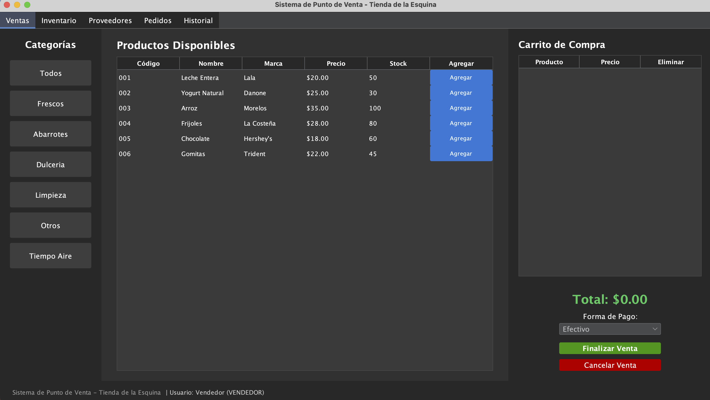
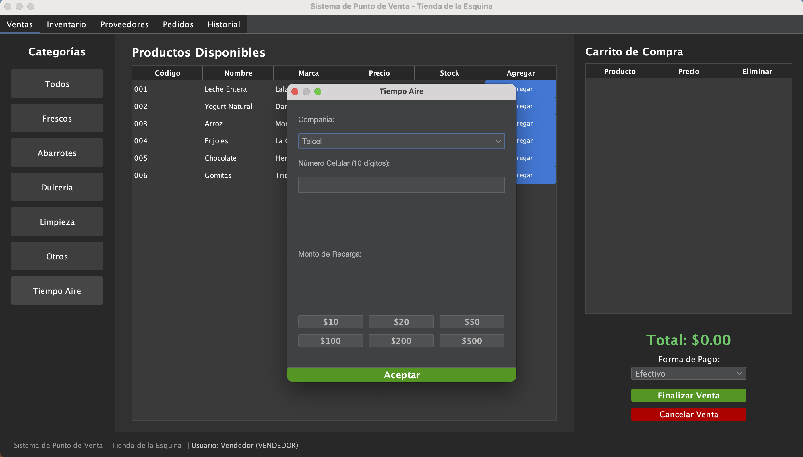

# Sistema de Gestión para Punto de Venta: "La Tiendita"

## 1. Información Institucional
* **Institución:** Instituto Politécnico Nacional (IPN)
* **Unidad Académica:** Unidad Profesional Interdisciplinaria de Ingeniería y Ciencias Sociales y Administrativas (UPIICSA)
* **Unidad de Aprendizaje:** Programación Orientada a Objetos
* **Alumno:** Sandoval Ramos Luis Alberto
* **Correo Institucional:** lsandovalr1901@alumno.ipn.mx
* **Semestre:** Tercero

## 2. Requisitos del Sistema
Para asegurar el correcto funcionamiento del software, el entorno de ejecución debe cumplir con:
* **Java Development Kit (JDK):** Versión 17 o superior.
* **Memoria RAM:** Mínimo 2GB disponibles.
* **Resolución de Pantalla:** 1024x768 o superior (Optimizado para visualización de tablas Swing).

## 🗺️ Diagrama de Clases UML

## 📸 Evidencia de Funcionamiento
### Interfaz de Ventas y Tiempo Aire
 

## 3. Guía de Instalación

### 3.1. Obtención del Software
Existen dos métodos para obtener los archivos del proyecto:

**A. Vía Repositorio Remoto (Recomendado):**
Ejecutar el siguiente comando en la terminal:
git clone https://github.com/LuisandovalU/Proyecto-POO-Tiendita-UPIICSA.git

**B. Vía Almacenamiento Externo (USB/Local):**
1. Copiar la carpeta raíz del proyecto al disco local.
2. Asegurarse de que la estructura de carpetas incluya los directorios `src` (código fuente) y `lib` (librerías externas).

### 3.2. Configuración de Dependencias (Librería FlatLaf)
El proyecto utiliza la librería **FlatLaf** para el diseño visual. Para que el proyecto compile sin errores:
1. Localizar el archivo `.jar` de FlatLaf dentro de la carpeta `lib` del proyecto.
2. En su IDE (IntelliJ, Eclipse, NetBeans), acceder a la configuración de la estructura del proyecto (Project Structure / Libraries).
3. Agregar el archivo `.jar` mencionado como una dependencia de biblioteca externa.

## 4. Instrucciones de Ejecución
1. Abrir su Entorno de Desarrollo (IDE).
2. Cargar el proyecto seleccionando la carpeta raíz.
3. Localizar la clase principal `Main.java` dentro del paquete `com.tienda`.
4. Ejecutar el comando `Run`.

## 5. Descripción de Módulos (Diagrama de Clases)
El sistema se rige por la arquitectura definida en el diagrama de clases adjunto:
* **Ventas:** Procesamiento de productos y servicios con cálculo de impuestos.
* **Tiempo Aire:** Interfaz independiente para recargas telefónicas con validaciones de 10 dígitos.
* **Inventario y Proveedores:** Registro de stock, mermas (Frescos) y órdenes de resurtido.
* **Promociones:** Motor de descuentos dinámicos para productos próximos a caducar.